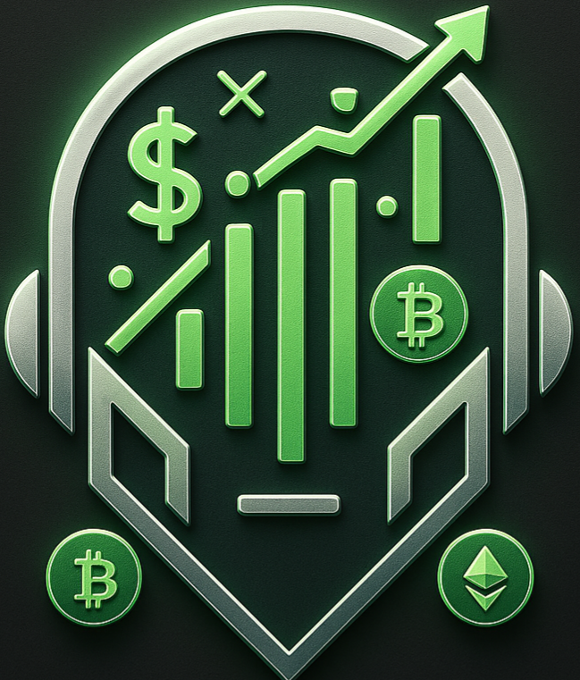

# AUTOBOT - Trading and Automation Framework



## Description

AUTOBOT est un framework complet pour le trading automatisé, l'apprentissage par renforcement et l'orchestration multi-agents. Il intègre des fonctionnalités avancées pour le trading algorithmique, la gestion des risques, l'apprentissage automatique, et la gestion d'inventaire e-commerce.

## Architecture

Le projet est structuré en plusieurs modules principaux :

### 1. Module de Trading

- **Fournisseur CCXT amélioré** : Intégration complète avec les échanges de cryptomonnaies
- **Gestionnaire de risque avancé** : Dimensionnement des positions, protection contre les drawdowns
- **Exécution des ordres** : Système robuste pour l'exécution des stratégies
- **Stratégies de trading** : Framework extensible pour implémenter diverses stratégies

### 2. Module d'Apprentissage par Renforcement (RL)

- **Agent RL** : Implémentation d'agents d'apprentissage par renforcement
- **Environnement de trading** : Simulation du marché pour l'entraînement des agents
- **Système d'entraînement** : Boucle d'apprentissage avec sauvegarde et chargement des modèles

### 3. Module de Sécurité

- **Authentification JWT** : Système sécurisé de gestion des sessions
- **Gestion des utilisateurs** : Création, authentification et gestion des utilisateurs
- **Système de licences** : Contrôle d'accès basé sur des licences avec fonctionnalités spécifiques

### 4. Orchestrateur Multi-Agent

- **Gestion des agents** : Création et supervision d'agents autonomes
- **Communication inter-agents** : Système de messagerie pour la collaboration
- **Allocation des ressources** : Distribution intelligente des tâches

### 5. Module E-commerce

- **Gestion d'inventaire** : Suivi des produits invendus
- **Tarification compétitive** : Algorithmes pour optimiser les prix
- **Traitement des commandes** : Système complet de gestion des commandes

### 6. Interface Utilisateur

- **Dashboard responsive** : Interface moderne avec thème sombre et éléments vert néon
- **Visualisations de données** : Graphiques et tableaux pour le suivi des performances
- **Gestion des stratégies et modèles** : Interface pour créer et surveiller les stratégies

## Installation

### Prérequis

- Python 3.10+
- Docker (optionnel)

### Installation avec pip

```bash
# Cloner le dépôt
git clone https://github.com/Flobi30/Projet_AUTOBOT.git
cd Projet_AUTOBOT

# Installer les dépendances
pip install -e .
pip install -r requirements.txt
```

### Installation avec Docker

```bash
# Construire l'image Docker
docker build -t autobot .

# Exécuter le conteneur
docker run -p 8000:8000 autobot
```

## Utilisation

### Démarrer l'API

```bash
uvicorn autobot.main:app --host 0.0.0.0 --port 8000 --reload
```

### Accéder à l'interface

Ouvrez votre navigateur et accédez à `http://localhost:8000/dashboard`

### API Documentation

La documentation de l'API est disponible à `http://localhost:8000/docs`

## Modules Principaux

### Trading

```python
from autobot.trading.strategy import MovingAverageStrategy
from autobot.providers.ccxt_provider_enhanced import CCXTProviderEnhanced

# Créer un fournisseur d'échange
provider = CCXTProviderEnhanced()
exchange = provider.create_exchange("binance", "api_key", "api_secret")

# Créer une stratégie
strategy = MovingAverageStrategy(
    name="ma_cross",
    exchange=exchange,
    symbol="BTC/USDT",
    timeframe="1h",
    parameters={"short_window": 10, "long_window": 50}
)

# Démarrer la stratégie
strategy.start()
```

### Apprentissage par Renforcement

```python
from autobot.rl.agent import RLAgent
from autobot.rl.env import TradingEnvironment
from autobot.rl.train import train_agent

# Créer un environnement
env = TradingEnvironment(
    exchange=exchange,
    symbol="BTC/USDT",
    timeframe="1h",
    parameters={"window_size": 100}
)

# Créer un agent
agent = RLAgent(
    name="dqn_agent",
    agent_type="dqn",
    env=env,
    parameters={"learning_rate": 0.001, "gamma": 0.99}
)

# Entraîner l'agent
train_agent(agent, episodes=1000)
```

### Orchestrateur Multi-Agent

```python
from autobot.agents.orchestrator import AgentOrchestrator

# Créer un orchestrateur
orchestrator = AgentOrchestrator()

# Ajouter des agents
agent_id = orchestrator.add_agent(
    agent_type="trading",
    agent_config={
        "exchange": "binance",
        "symbol": "BTC/USDT",
        "strategy": "ma_cross"
    }
)

# Démarrer l'orchestrateur
orchestrator.start()
```

### E-commerce

```python
from autobot.ecommerce.inventory_manager import InventoryManager

# Créer un gestionnaire d'inventaire
inventory_manager = InventoryManager()

# Synchroniser l'inventaire
inventory_manager.sync_inventory()

# Optimiser les prix
inventory_manager.optimize_prices()

# Passer une commande
order = inventory_manager.place_order(
    product_ids=["product1", "product2"],
    quantities=[1, 2],
    user_id="user123"
)
```

## Licence

Ce projet est sous licence propriétaire. Tous droits réservés.

## Auteur

Développé par Flobi30 avec l'assistance de Devin AI.
