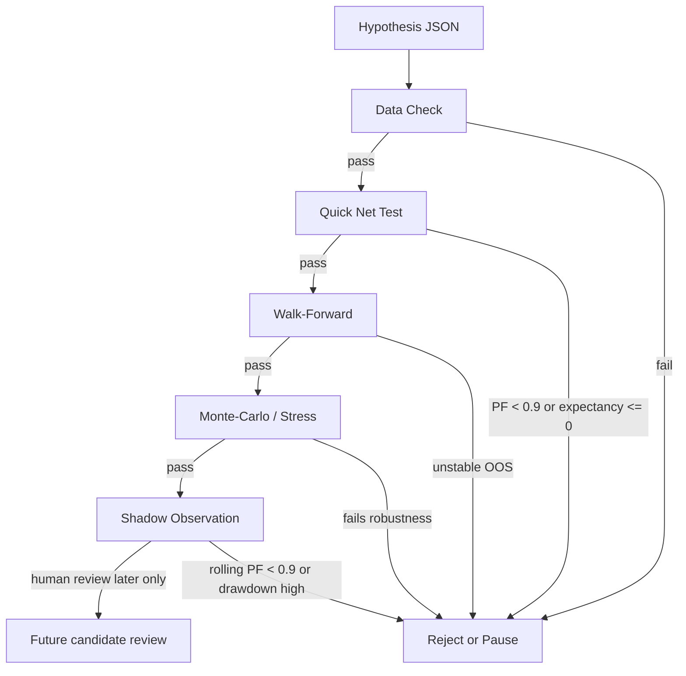

# AUTOBOT Alpha Hypothesis Lab

This lab is research-only. It does not create orders, does not allocate paper capital, and does not promote strategies.

## Status Boundary

| State | Meaning | Paper capital | Live |
|---|---|---:|---:|
| `idea` | Hypothesis is documented only | false | false |
| `data_check` | Required data quality is being checked | false | false |
| `quick_test` | Net-of-cost smoke validation | false | false |
| `walk_forward` | Time-split validation | false | false |
| `monte_carlo` | Trade-sequence and stress robustness | false | false |
| `shadow` | Observation only | false | false |
| `rejected` | Failed evidence gate | false | false |
| `paused` | Not currently worth compute budget | false | false |

## Validation Flow

## Compute Budgets

| Step | Max CPU minutes | Max variants | Max symbols |
|---|---:|---:|---:|
| data_check | 5 | 1 | 14 |
| quick_net_test | 10 | 3 | 14 |
| walk_forward | 20 | 5 | 14 |
| monte_carlo_stress | 10 | 2 | 14 |
| shadow_observation | 5 | 1 | 14 |

## Auto-Stop Rules

- Stop if required data is missing.
- Stop if rolling PF net is below `0.9` after 30 closed trades.
- Stop if expectancy is non-positive out-of-sample.
- Stop if two consecutive out-of-sample folds are negative.
- Stop if bootstrap expectancy upper confidence bound remains below zero.
- Stop if shadow drawdown exceeds the configured threshold.

## Benchmarks

- `grid` / `dynamic_grid`: archived/no-go, tombstone only.
- `trend_momentum`: benchmark only.
- `mean_reversion`: benchmark only.
- `high_conviction_swing`: research only after P17 rejection of current configuration.

No benchmark is allowed to become paper or live through this lab.
