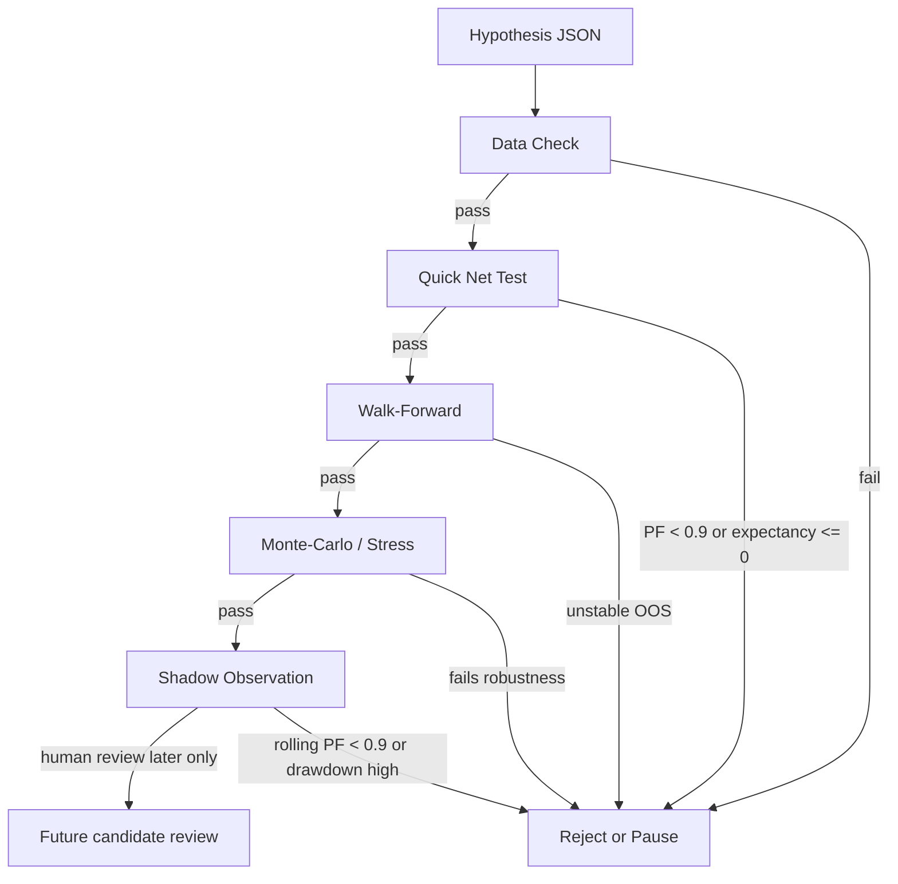

# P18A - Repo Audit, Safe Cleanup and Alpha Hypothesis Lab

Date: 2026-07-09
Scope: repository maintenance + research-only alpha hypothesis preparation

## Trading Safety

No runtime trading path was executed or changed.

- Live: not enabled
- Paper capital: not enabled
- Auto-promotion: not enabled
- UI: unchanged
- Grid: remains archived/no-go
- Trend/Mean Reversion: benchmark only
- High Conviction: research only

## Inventory Commands

Local equivalents and VPS checks used for the audit:

```bash
# Local / repo audit
python -m compileall -q src
python -m pytest tests/research/test_alpha_hypothesis_lab.py tests/research/test_repo_maintenance.py -q

# Inventory style checks
# du/find/wc equivalents were captured by Python path_size, AST import graph, and SQLite read-only queries.
# VPS follow-up uses du/find/wc/docker/curl for health and disk state.
```

## Size Before Cleanup

| Folder | Size |
|---|---:|
| `data` | 291.47 MB |
| `dashboard` | 171.60 MB |
| `reports` | 120.29 MB |
| `.codex_python_deps` | 35.91 MB |
| `src` | 16.83 MB |
| `tests` | 6.30 MB |
| `artifacts` | 263.45 KB |
| `adaptive_grid_files` | 220.34 KB |
| `.pytest_cache` | 146.47 KB |
| `skills` | 114.01 KB |
| `docs` | 80.50 KB |
| `tools` | 28.99 KB |

Cleanup candidates before:

- count: `2148`
- size: `70.87 MB`

## Cleanup Manifest

Manifest: `reports/research/p18a_cleanup_manifest_2026-07-09.json`

- candidates processed: `2148`
- deleted entries: `2148`
- deleted size: `70.87 MB`
- databases deleted: `False`
- reports deleted: `False`
- backups deleted: `False`
- secrets deleted: `False`

Deleted categories were limited to generated caches and local logs:

- `__pycache__` directories
- `.pyc` / `.pyo` files
- `.pytest_cache`
- generated `.log` files outside protected folders

Protected and not deleted:

- `data/*.db`, `*.db-wal`, `*.db-shm`
- `reports/*`
- `backups/*`
- `.env*`, keys, secrets
- research datasets and historical reports

## Size After Cleanup

| Folder | Size |
|---|---:|
| `data` | 291.53 MB |
| `dashboard` | 171.60 MB |
| `reports` | 120.67 MB |
| `.codex_python_deps` | 18.99 MB |
| `src` | 4.56 MB |
| `tests` | 854.50 KB |
| `artifacts` | 149.15 KB |
| `skills` | 114.01 KB |
| `adaptive_grid_files` | 102.23 KB |
| `docs` | 80.50 KB |
| `tools` | 28.99 KB |
| `.github` | 10.54 KB |

Remaining cleanup candidates after audit scripts ran:

- count: `11`
- size: `172.07 KB`

These are regenerated Python caches from running audit/tests and are ignored by Git.

## Import Graph

AST import graph summary:

- nodes: `265`
- edges: `630`
- NetworkX available: `True`
- strongly connected components >1: `4`
- parse errors: `0`

The graph is for dependency orientation only; no runtime path was changed.

## SQLite Inventory

| DB | Size | Tables | Sample table counts |
|---|---:|---:|---|
| `C:/Users/flore/Documents/Codex/2026-04-27/bonjour-voil-j-ai-utilis-r/Projet_AUTOBOT/data/autobot_state.db` | 204.00 KB | 13 | audit_events=132, decision_ledger=0, instance_lineage=0, instance_state=0, market_price_samples=0, order_state_transitions=0, orders=0, positions=0 |
| `C:/Users/flore/Documents/Codex/2026-04-27/bonjour-voil-j-ai-utilis-r/Projet_AUTOBOT/data/global_kill_switch.db` | 8.00 KB | 1 | global_kill_state=1 |
| `C:/Users/flore/Documents/Codex/2026-04-27/bonjour-voil-j-ai-utilis-r/Projet_AUTOBOT/data/nonce_state.db` | 12.00 KB | 1 | nonce_state=0 |
| `C:/Users/flore/Documents/Codex/2026-04-27/bonjour-voil-j-ai-utilis-r/Projet_AUTOBOT/data/setup_shadow_lab.db` | 20.00 KB | 3 | setup_shadow_state=0, setup_shadow_trades=0, sqlite_sequence=0 |
| `C:/Users/flore/Documents/Codex/2026-04-27/bonjour-voil-j-ai-utilis-r/Projet_AUTOBOT/data/vps_autobot_state_2026-06-01.db` | 46.88 MB | 13 | audit_events=683, decision_ledger=3212, instance_lineage=0, instance_state=14, market_price_samples=87490, order_state_transitions=17270, orders=5811, positions=629 |
| `C:/Users/flore/Documents/Codex/2026-04-27/bonjour-voil-j-ai-utilis-r/Projet_AUTOBOT/data/vps_autobot_state_2026-06-04_2026-06-04_121159.db` | 62.88 MB | 13 | audit_events=683, decision_ledger=3234, instance_lineage=0, instance_state=14, market_price_samples=135046, order_state_transitions=17270, orders=5811, positions=629 |

All SQLite reads were read-only. No database was vacuumed, deleted, or rewritten.

## Research Tool Inventory

| Module | Decision | CPU/RAM | Reason |
|---|---|---|---|
| `metrics_engine.py` | KEEP_CORE | L | Core net/PF/expectancy metrics. |
| `backtest_engine.py` | KEEP_CORE | M | Core validation harness. |
| `walk_forward.py` | KEEP_CORE | M | Required to reject unstable ideas. |
| `high_conviction_walk_forward.py` | KEEP_CORE | M | Current strict validation path for high_conviction_swing. |
| `statistical_validation.py` | KEEP_CORE | M | Bootstrap/confidence/research gates. |
| `purged_cv.py` | KEEP_CORE | M | Anti-overfitting guard. |
| `loss_attribution.py` | KEEP_CORE | M | Explains losing segments. |
| `validation_matrix.py` | KEEP_ON_DEMAND | M | Batch comparisons; not runtime. |
| `batch_strategy_validation.py` | KEEP_ON_DEMAND | M | Useful for benchmarks only. |
| `grid_experiment_runner.py` | KEEP_ON_DEMAND | M | Historical/tombstone grid research only. |
| `strategy_orchestrator.py` | KEEP_ON_DEMAND | M/H | Research allocator simulation only. |
| `strategy_regime_walk_forward.py` | KEEP_ON_DEMAND | M | Regime-specific audit. |
| `strategy_regime_report.py` | KEEP_ON_DEMAND | L | Report helper. |
| `strategy_regime_baselines.py` | KEEP_ON_DEMAND | L | Benchmark helper. |
| `relative_value_engine.py` | KEEP_ON_DEMAND | M | NO GO candidate retained for reproducibility if present. |
| `sentiment_nlp.py` | REWRITE_LATER | H | External/heavy signal source; should remain dormant. |
| `regime_detector.py` | KEEP_ON_DEMAND | L/M | Feature provider only. |
| `monte_carlo / bootstrap paths` | KEEP_CORE | M | Needed for future alpha rejection and robustness. |

Principle: keep tools that help reject bad ideas. Delete nothing that is needed for reproducibility until a dedicated archival PR exists.

## Alpha Hypotheses Added

File: `docs/research/alpha_hypotheses.json`
Schema: `docs/research/alpha_hypotheses.schema.json`
Docs: `docs/research/ALPHA_HYPOTHESIS_LAB.md`

Initial hypotheses:

1. `funding_basis`
2. `liquidation_cascade`
3. `volatility_breakout`
4. `cross_momentum`
5. `long_trend`

All are explicitly:

- `promotable=false`
- `paper_capital_allowed=false`
- `live_allowed=false`
- `research_only=true`

## Batch / Online Validation Flow



Sequential gates are implemented in `src/autobot/v2/research/alpha_hypothesis_lab.py`:

- data check
- quick net test
- walk-forward
- Monte-Carlo / stress
- shadow observation

Budgets are encoded per step:

- CPU minutes
- max variants
- max symbols

Auto-stop examples:

- missing required data
- rolling PF net below `0.9`
- expectancy non-positive OOS
- two consecutive negative OOS folds
- bootstrap expectancy upper bound below zero
- shadow drawdown above threshold

## Tests Added

- `tests/research/test_alpha_hypothesis_lab.py`
- `tests/research/test_repo_maintenance.py`

Coverage added:

- alpha hypotheses cannot enable paper/live/promotion
- missing required alpha fields are rejected
- gates can pass research checks but remain non-promotable
- cleanup candidates exclude critical DB paths
- cleanup manifest records deletions
- import graph uses AST and optional NetworkX

## Tests Missing / Follow-Up

- Full CI runtime is still broad and may be slow.
- A future PR should add a scheduled audit command instead of ad-hoc report generation.
- A future archival PR can move legacy root scripts into a tombstone folder after human review.
- OHLCV deduplication should be done by dataset builders, not destructive deletion of raw research history.

## Recommendations

1. Keep P18A as a cleanup and governance commit, not a strategy commit.
2. Do not delete historical reports or DB snapshots yet.
3. Use the alpha lab only to reject weak ideas quickly.
4. P18B should implement one small read-only alpha smoke runner against the five hypotheses, starting with `volatility_breakout` or `long_trend`, without capital.
